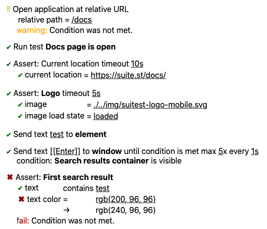

# SMST 2 HTML

A library to convert smst to HTML fragment.

For a complete demo on library usage check out [SuitestAutomation/translate-demo] repo.

Usage example:

```javascript
import {translateTestLineResult} from '@suitest/translate';
import {toHtml} from '@suitest/smst-to-html';

// Fetch data you need to translate, e.g. using Suitest Network API
const testLineDefinition = {/* get line definition somehow */};
const testLineResult = {/* get line definition somehow */};
const appConfig = {/* get app configuration somehow */};

const smst = translateTestLineResult({
    testLine: testLineDefinition,
    lineResult: testLineResult,
    appConfig,
});

const htmlFragmentLine = toHtml(smst);
```

## Output examples



[SuitestAutomation/translate-demo]: https://github.com/SuitestAutomation/translate-demo
