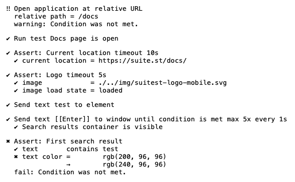
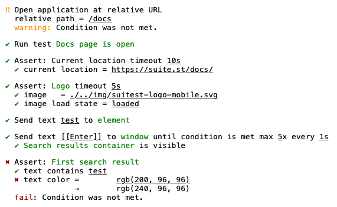

# SMST 2 TEXT

A library to convert smst to plain text and formatted text.

For a complete demo on library usage check out [SuitestAutomation/translate-demo] repo.

Usage example:

```javascript
import {translateTestLineResult} from '@suitest/translate';
import {toText} from '@suitest/smst-to-text';

// Fetch data you need to translate, e.g. using Suitest Network API
const testLineDefinition = {/* get line definition somehow */};
const testLineResult = {/* get line definition somehow */};
const appConfig = {/* get app configuration somehow */};

const smst = translateTestLineResult({
    testLine: testLineDefinition,
    lineResult: testLineResult,
    appConfig,
});

const plainTextLine = toText(smst);

// Or if you want a text with ANSI formatting
const formattedTextLine = toText(smst, true);
```

## Output examples

### Plain text



### Formatted text



[SuitestAutomation/translate-demo]: https://github.com/SuitestAutomation/translate-demo
